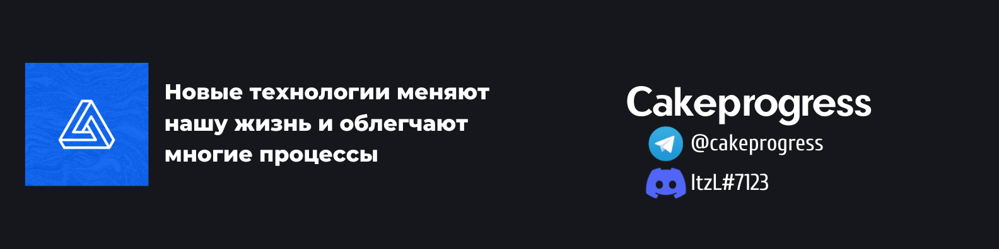

  
  <h2>Привет :hand:, меня зовут Дмитрий</h2>
  <h1>Я занимаюсь разработкой игровых проектов, прикладным программированием и капелькой фронтэнда</h1>  

Я люблю заниматься программированием. Иногда пытаюсь писать различные прикладные и веб приложения< если возникет такая необходимость :smile: Не против помочь с обучением или ответить на вопросы.

### Вы можете связаться со мной(кликабельно) :iphone: :

   

### Работал(ю) со следующими языками:
  

  
### Работал(ю) со следующими технологиями:

* Spring Framework (Уточняйте конкретно, фреймворк очень большой :smile: )
* JavaFX
* MySql
* JPA
 

### Что могут разработать:

* Боты (Telegram, Discord)
* Графические интерфейсы (CSS, JavaFX)
* Разработка дополнений к игре Minecraft (1.5.2 - 1.16.5)

### DevOps:
### Конфигурация:
* CloudFlare, под ваши нужды.
* Apache/NGINX веб серверов.
* Mysql/MariaDB баз данных.
* PhpMyAdmin/DBEaver.
* Первоначальная настройка Linux сервера под ваши нужды.
* Резервное копирования важных данных с Linux сервера на внешний FTP сервер.

### Сервер-менеджмент:

* Контейнеризация серверного стека.

### Если ваша задача не входит в вышеперечисленные - это не значит, что я не смогу её сделать. Если вы видите, что я обладаю необходимым стеком для её реализации, напишите мне в лс для обсуждения ТЗ.

 
 
 
